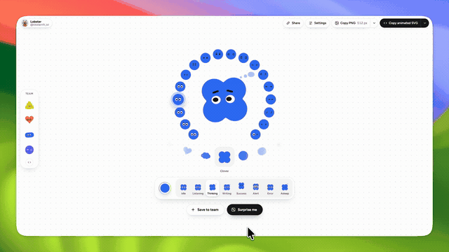

# Dots Lab

**Design an animated character for your AI agent — then export it as PNG, SVG or GIF.**

A single-file, dependency-free web app: pick a shape, give it a face, tune the colour, and watch it come alive across eight agent states. Everything runs client-side — no build step, no backend, no npm install.



[▶ Watch the full 43-second demo (1600×900 MP4)](preview/dots-lab-demo.mp4) · [Still preview (PNG)](preview/dots-lab-preview.png)

---

## What it is

Dots Lab is a mascot designer for AI agents and developer tools. You sculpt a small character (a "dot"), preview it animating in real time, and export it in whatever format your product needs — a static asset, a looping animated SVG, or a GIF for slides and Figma.

The whole application is one `index.html` file with inline CSS and JavaScript. There is no framework, no bundler and no runtime dependency.

## Features

**Design**

- **12 shapes** — Round, Pebble, Capsule, Drop, Flame, Triangle, Square, Briefcase, Star, Heart, Cloud, Clover.
- **18 expressions** — every combination of ten eye styles (Toon, Pills, Dots, Rings, Happy, Plus, Dashes, Slashes, `> <`, Wink) with five brow styles (None, Straight, Angry, Worried, Skeptical).
- **18 colours plus a custom picker** — a radial colour wheel with a vivid outer ring, a neutral/pastel inner ring, and a free colour input.
- **Fine control** — eye size, eye spacing, tilt and ink colour (auto-contrast, black or white).
- **19 curated presets** across three families (Cartoon, Pills, Glyphs) to start from.

**Animation**

- **8 agent states** — Idle, Listening, Thinking, Writing, Success, Alert, Error, Asleep. Each is a hand-authored looping choreography, not a simple tween: asymmetric blinks, gaze that overshoots then settles, a squash-and-stretch hop on Success, and eyes that fall and bounce on Error.
- **Live reactions** — the dot watches your cursor, and clicking it triggers one of three reactions (boing, giggle, love).
- **Direct manipulation** — drag the dot to change eye size and spacing on the fly.

**Organise and export**

- **Team rail** — save up to 12 dots to a sidebar (persisted in `localStorage`), switch between them, and export the whole team as one sheet.
- **PNG** — 128 / 256 / 512 / 1024 px, transparent, copied straight to the clipboard.
- **SVG** — static or self-animating. The animated export is SMIL (sampled at 20 fps), so it loops in an `` tag with no JavaScript.
- **GIF** — encoded in-browser with a hand-rolled LZW encoder and a per-clip adaptive 256-colour palette, with white or transparent background.
- **Bulk export** — download all eight states as SVG + PNG + GIF in a single `.zip` (written with a dependency-free ZIP writer).
- **Share links** — the full configuration is encoded into the URL hash as a compact base36 token, e.g. `#m1…`.

## Getting started

The app is a static file, but it must be served over `http://` or `https://` — the Clipboard API (used for copying PNGs, SVGs and share links) is only available in a secure context, so opening it via `file://` degrades to a manual copy/paste fallback panel.

```bash
# Zero-dependency static server (Node built-ins only)
node server.mjs            # http://127.0.0.1:4173/
node server.mjs --port 8080
PORT=8080 node server.mjs
```

Or with anything else that serves static files:

```bash
python3 -m http.server 4173
npx serve .
```

Then open <http://127.0.0.1:4173/>.

## Keyboard support

| Context | Keys | Action |
| --- | --- | --- |
| Expression ring | <kbd>←</kbd> <kbd>→</kbd> <kbd>↑</kbd> <kbd>↓</kbd> | Move between the 18 expressions |
| Shape carousel | <kbd>←</kbd> <kbd>→</kbd> | Previous / next shape |
| Dot | <kbd>Enter</kbd> / <kbd>Space</kbd> | Trigger a reaction |
| Menus & panels | <kbd>↑</kbd> <kbd>↓</kbd>, <kbd>Esc</kbd> | Navigate, close |

## Project structure

```
.
├── index.html              # the entire app (inline CSS + JS, no dependencies)
├── server.mjs              # zero-dependency static file server
├── README.md
└── preview/
    ├── dots-lab-demo.gif       # inline motion preview (8 s, 640 px)
    ├── dots-lab-demo.mp4       # full demo, 1600×900 / 43 s
    └── dots-lab-preview.png    # still preview, 1600×900
```

## Notes on the implementation

A few details that might be interesting if you are reading the source:

- **Shape geometry** is generated procedurally — superellipses, polar functions, rounded polygons and unions of discs — then resampled, smoothed and normalised. Nothing is a bitmap.
- **The SVG exporter** is a shim that re-implements the small slice of the Canvas 2D API the renderer uses, so the exact same drawing code produces both the on-screen canvas and the exported vector file. Arcs are flattened to line segments; ellipses and rects stay as native SVG primitives.
- **The animated SVG export** samples the current state's choreography at 20 fps and emits SMIL keyframes, collapsing identical consecutive frames so the file stays small.
- **The GIF encoder** does two passes over the rendered frames (colour histogram, then LZW) with run-length merging of identical frames, entirely in the browser.
- **The background dot grid** is a canvas that stays static until something happens, then renders a single expanding ripple that displaces and tints the dots near its wavefront.

## Accessibility

- `prefers-reduced-motion` is respected — all choreography and transitions stop.
- The expression ring and shape carousel use roving tabindex, so each is a single tab stop navigated with arrow keys.
- Interactive controls are real `<button>` elements with labels, roles and `aria-pressed` / `aria-checked` state.
- Body text colours meet WCAG AA contrast (4.5:1) against the page background.

## Credits

The original design and implementation of Dots Lab are by **Guillaume** ([@guillaume_rygn](https://x.com/guillaume_rygn)) — <https://dots-lab.pages.dev>.

This repository is a local replica of that site. The app is otherwise unchanged; on top of it this copy adds a UI/UX pass (mobile toolbar and action-row layout fixes, a stray-16px-scrollbar fix, WCAG AA contrast on secondary text, roving-tabindex keyboard navigation for the expression ring, a touch-device hint, page metadata and favicon) and removes roughly 2.8 KB of dead CSS/JS. See the commit history for the details.

The `preview/` assets are screen recordings of this copy.

## License

No license is claimed over the original work, which belongs to its author. If you intend to reuse or redistribute the design, please credit and/or contact the original author.
